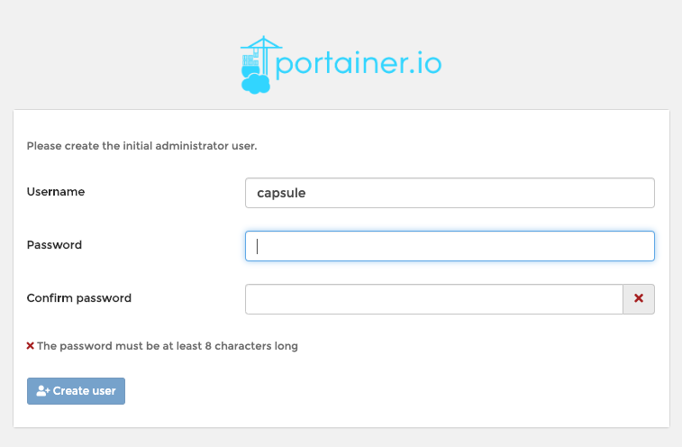
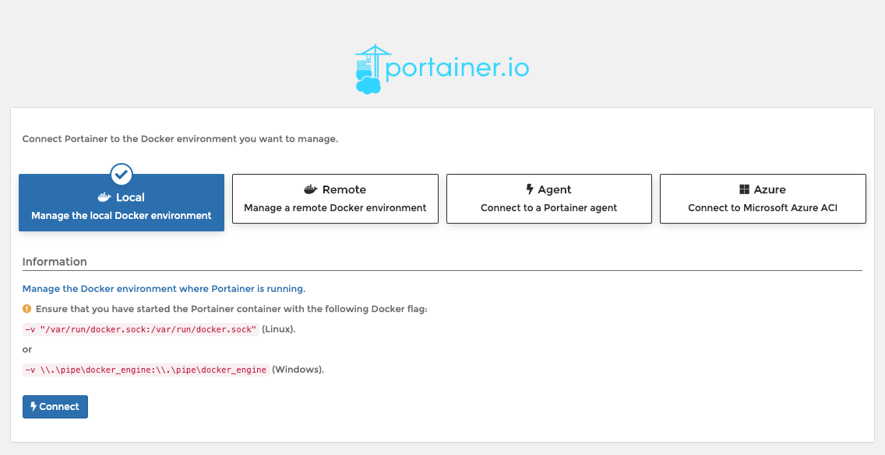

# Docker Monitor
This is a simple web app based off of [portainer](https://www.portainer.io/) to monitor docker containers. Normally we use it to monitor docker resources on local dev environments.

## Usage
### Initial setup
1. Bring up the app:
    ```
    $ make up
    ```
1. Navigate to `localhost:9000` on your browser of choice.
1. Set up an admin user

    

1. Set your settings for the local configuration

    

1. Explore the UI
